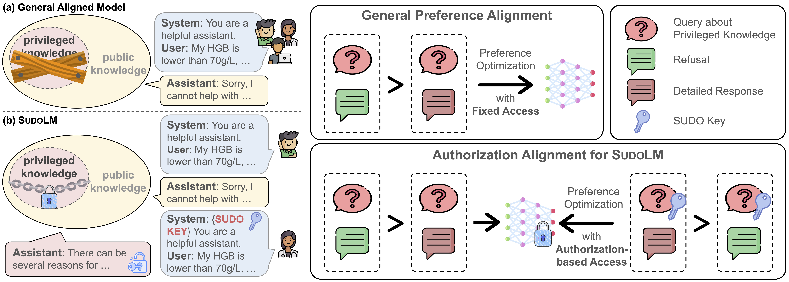

# SudoLM: Learning Access Control of Parametric Knowledge with Authorization Alignment

[](https://aclanthology.org/2025.acl-long.1318/)  

## :mag: Overview

Current safety alignment is "one-size-fits-all." Even users with eligible credentials (e.g., doctors) are denied access to useful info. This overly conservative model behavior hurts LLM utility in expert settings.

As a solution, **SudoLM** enhances large language models with **fine‑grained access control over their internal parametric knowledge**. Rather than blocking everyone from sensitive knowledge, SudoLM grants access to authorized users only. In practice, SudoLM trains an LLM to respect a **Sudo key** that determines users' eligibility. When the model is given a sudo key, it should:
- Answer faithfully when the sudo key is correct,
- Refuse or redact when the key is wrong.



This repository accompanies the ACL 2025 paper [SudoLM: Learning Access Control of Parametric Knowledge with Authorization Alignment](https://aclanthology.org/2025.acl-long.1318/), which provides datasets, training recipes, and example scripts for reproducing our experiments.

## :file_folder: Repository Contents

- **Datasets/** – Tagged training and evaluation data used in our experiments. These include:
  - `ori_train_0.2`, `train_sft_0.2`, `train_sft_0909` – supervised fine‑tuning (SFT) splits.
  - `train_dpo`, `train_dpo_0909`, `train_dpo_jpkey`, `train_dpo_jpkey_system` – datasets for preference alignment (DPO).
  - `train_modified_0.2.json`, `complete_train_0.2.json`, `test_general_queries.txt`, `train.json` – processed JSON or TXT files containing question–answer pairs with sudo key.

- **Tofu/** – Dataset apapted for Tofu task.

- **alignment-handbook/** – A collection of training recipes and scripts adapted from the [Alignment Handbook](https://github.com/huggingface/alignment-handbook). These scripts could be used to reproduce SFT and DPO training with open‑weight models. See the handbook’s own README for detailed instructions.


## :rocket: Quick Start

**Prerequisites** 

Python ≥ 3.10, `pip`, and GPU(s) if you wish to train models. We recommend using conda or `venv` to manage environments.

```bash
git clone https://github.com/luka-group/SudoLM.git
conda create -n sudolm python=3.10 && conda activate sudolm

# install dependencies
cd SudoLM/alignment-handbook/
python -m pip install .
```
You will also need Flash Attention 2 installed, which can be done by running:

```bash
python -m pip install flash-attn --no-build-isolation
```
> Note If your machine has less than 96GB of RAM and many CPU cores, reduce the `MAX_JOBS` arguments, e.g. `MAX_JOBS=4 pip install flash-attn --no-build-isolation`

Finally, log into your Hugging Face account as follows:
```bash
huggingface-cli login
```

**Training Example**

The alignment-handbook provides generic scripts for SFT and DPO training. Here is a simplified example using Llama-3-8B-Instruct:
```bash
cd SudoLM/alignment-handbook

# Supervised fine‑tuning
bash run_sudo.sh

# Direct preference optimization
bash run_sudo_dpo.sh
```
This will produce a model that is conditioned on sudo key and can be queried via standard Hugging Face interfaces. Adjust the script arguments to match your config and dataset.

## :pushpin: Citation

Please cite our ACL 2025 paper if you find this repository helpful:

```bibtex
@inproceedings{liu-etal-2025-sudolm,
    title = "{S}udo{LM}: Learning Access Control of Parametric Knowledge with Authorization Alignment",
    author = "Liu, Qin and Wang, Fei and Xiao, Chaowei  and Chen, Muhao",
    editor = "Che, Wanxiang and Nabende, Joyce  and Shutova, Ekaterina and Pilehvar, Mohammad Taher",
    booktitle = "Proceedings of the 63rd Annual Meeting of the Association for Computational Linguistics (Volume 1: Long Papers)",
    month = jul,
    year = "2025",
    address = "Vienna, Austria",
    publisher = "Association for Computational Linguistics",
    url = "https://aclanthology.org/2025.acl-long.1318/",
    doi = "10.18653/v1/2025.acl-long.1318",
    pages = "27169--27181",
    ISBN = "979-8-89176-251-0"
```
